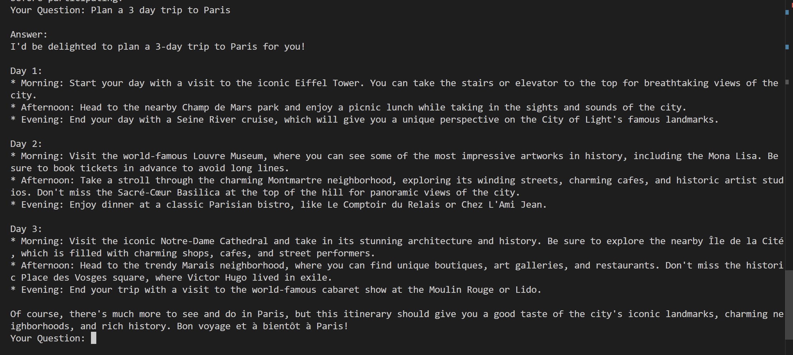

# 🤖 Travel Planner Chatbot
#### This project is a travel-focused semantic chatbot that fetches and parses destination content from Wikivoyage using the MediaWiki API, structures it into sections (like “Get In,” “See,” “Do,” etc.), and stores both the text and its vector embeddings in a PostgreSQL database using pgvector. It enables natural language queries using LangChain and Llama3 to retrieve relevant, sectioned content from travel data across global cities.

## How it works-
1. **DATA FETCHING-**  Uses the MediaWiki API to get HTML content from Wikivoyage pages and parses it into clean sections using BeautifulSoup.
2. **STRUCTURED PARSING-** Each city is stored with its region and parsed section in a DataFrame, then exported to a CSV (travel_data.csv) for embedding.
4. **EMBEDDINGS-** For each section of each city, generates embeddings using Ollama with nomic-embed-text model and stores the embeddings in a PostgreSQL database using pgvector.
5. **SEMANTIC RETRIEVAL-** Travel contant is loaded from the database and chunked using LangChain's RecursiveCharacterTextSplitter.
6. **QA Chain-** Used LangChain’s RetrievalQA combining Llama3 LLM and PGVector retriever for answering natural language queries.

Here is an example with query- Plan a 3 day trip to Paris.

